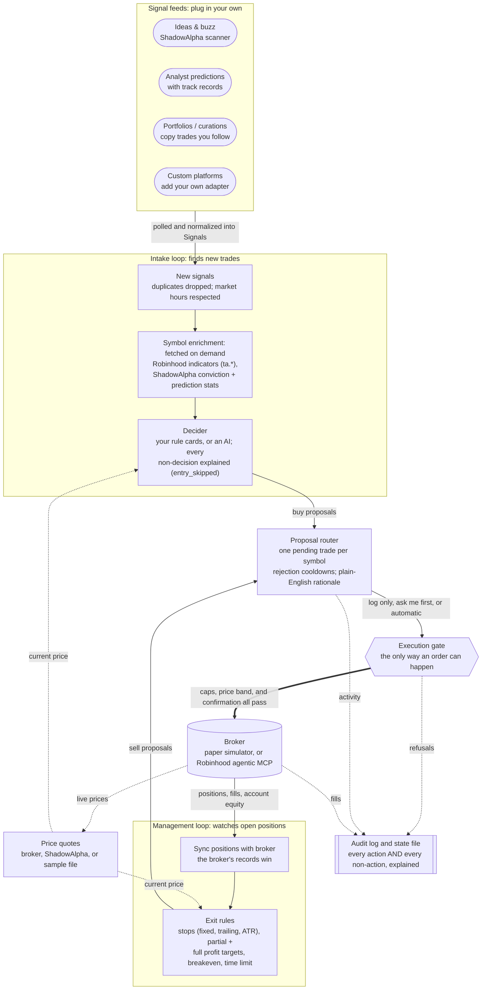
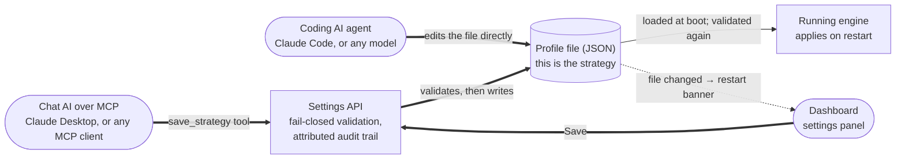

# Shadow Cortex

A central decision engine for automated stock trading using ShadowAlpha MCP
and Robinhood MCP. A lean, open-source, self-hosted template: it ingests
signals from any source through one adapter contract (ShadowAlpha's MCP is the
reference), runs them through a swappable decision strategy, manages open
positions with customizable exit logic, and routes paper or live orders
through a guarded execution layer, all driven by a single settings file that
IS your strategy.

This is a **reference implementation and a free giveaway**, not a product or a
service. You hold your own keys, you run it yourself, and you bear your own
risk. It is not supported by ShadowAlpha the company.

> **Not investment advice.** Nothing this engine prints, proposes, or executes
> is a recommendation. You own every cap, every stop, and every consequence,
> including the choice to disable them. Automated trading can lose money
> quickly. Read the code before you trust it with a dollar.

## Contents

- [Requirements](#requirements)
- [Quickstart (zero credentials, nothing real)](#quickstart-zero-credentials-nothing-real)
- [How the engine works](#how-the-engine-works)
- [The dashboard](#the-dashboard)
- [The three scenarios](#the-three-scenarios)
- [Your strategy is a settings file](#your-strategy-is-a-settings-file)
- [The caps model (read this before going live)](#the-caps-model-read-this-before-going-live)
- [Exit rules](#exit-rules)
- [Environment variables](#environment-variables)
- [Connecting your accounts (no terminal needed)](#connecting-your-accounts-no-terminal-needed)
- [Using it for real (paper first)](#using-it-for-real-paper-first)
- [Driving the engine from Claude Desktop (or any MCP client)](#driving-the-engine-from-claude-desktop-or-any-mcp-client)
- [Extending it](#extending-it)
- [Repository map](#repository-map)
- [State, logs, and resetting](#state-logs-and-resetting)
- [Development](#development)
- [Troubleshooting](#troubleshooting)
- [License & disclaimers](#license--disclaimers)

## Requirements

- **Node.js ≥ 20** and npm. That's it: the demo, the tests, and the
  dashboard all run offline with zero credentials and no network.
- Optional, only when you want them: a ShadowAlpha MCP token (live signals),
  an Anthropic API key (AI decider/narrator), a Robinhood account (live
  monitoring/trading).

## Quickstart (zero credentials, nothing real)

### Option A: let an AI set it up for you

New to GitHub or the terminal? Paste this prompt into an AI coding assistant
that can run commands on your computer (Claude Code, Cursor, and similar).
It installs the offline demo and turns your AI into an expert on this engine:

```text
Set up Shadow Cortex (an open-source, self-hosted paper-trading engine
template) on this computer:

1. Check that git and Node.js 20 or newer are installed; help me install
   them if they are missing.
2. Clone https://github.com/shadowalpha-ai/shadow-cortex.git into a
   sensible folder.
3. In that folder run: npm install && npm run ui:build && npm run dev
   (keep it running).
4. Open http://127.0.0.1:7777 in my browser. This demo uses fixture data
   only: no accounts, no credentials, no real money. If no trade proposal
   appears, untick "Market hours only" in the Settings tab.
5. Before advising me on anything, become an expert on this engine. Read:
   README.md; docs/DATAPOINTS.md (every datapoint entry criteria can use);
   docs/AUTHORING.md (the extension contracts); docs/robinhood-discovery.md
   (the live-broker integration); CLAUDE.md; and
   .claude/skills/edit-strategy/SKILL.md (how an AI edits the strategy
   safely). The active strategy file is profiles/scenario3.json.
6. Then give me a tour: what the dashboard shows, how to confirm the demo
   trade, and the safety model (paper vs live; execution off/confirm/auto;
   the caps I own). Never connect real accounts, enable live mode, or
   enable auto execution unless I explicitly ask you to.
```

### Option B: do it yourself

```
git clone https://github.com/shadowalpha-ai/shadow-cortex.git
cd shadow-cortex
npm install
npm run ui:build
npm run dev
```

That starts **scenario 3, paper mode, confirm execution, deterministic
decider** against replayable fixture data: no network, no keys, no real
broker. Within a few seconds a rule-matched entry proposal appears on the
dashboard with Confirm/Reject buttons:

```
BUY $NVDA — rule "ShadowAlpha buzz + analyst-backed" matched. 0.134481 shares @ ~$185.9 ≈ $25.00
  Awaiting confirmation (dashboard Confirm/Reject, or CLI).
```

**Confirm it within ~10 seconds** and you'll watch the whole lifecycle: the
paper position appears, the replayed price climbs to a peak, and the
management loop's trailing stop fires a SELL proposal off the high-water mark:
the closed loop, end to end, on a position you opened. Everything lands in
the append-only audit log at `state/audit.jsonl`. To replay from scratch:
`rm -rf state && npm run dev`.

The demo profile trades only during market hours (`marketHoursOnly: true`;
it suppresses proposal creation as well as gating execution). Running it
evenings or weekends? Untick **Market hours only** in the Settings tab (or
edit the profile) to replay the fixture demo any time. Rejecting a proposal
also starts a per-symbol cooldown (`entry.rejectionCooldownMinutes`, default
30) so the engine doesn't immediately re-ask about the same symbol.

## How the engine works

A stable core, pluggable edges, and one settings file. Two simple loops do
the work: the **intake loop** turns incoming signals into trade proposals,
and the **management loop** watches open positions. Every order, buy or
sell, must pass through a single guarded gate.



The strategy itself lives in one place, with three editors, all funneled
through the same fail-closed validation:



### The safety rules: guaranteed by how it's built

- **Any source, same core.** The core never knows where a signal came from.
  `Signal` is the only contract, and entry rules read its `fields` dictionary,
  so a new data source plugs in with zero changes to the core.
- **One order path.** The execution gate is the only place an order can
  happen. No decider, not even a full AI agent, can bypass it or exceed a
  cap you have set.
- **Caps only block new buys.** Exposure caps and the daily-loss halt stop
  new purchases. A sell that reduces your risk is never blocked; a stop-loss
  always gets through.
- **The broker is the source of truth.** Positions, fills, and account equity
  are read back from the broker on every management cycle. The engine
  corrects itself to match the broker, never the other way around.
- **Refuses rather than guesses.** Invalid settings refuse to run. A signal
  missing a required field fails that rule instead of guessing. Out of the
  box, the engine is in paper-trading mode with execution switched off.
- **Everything is recorded.** Every proposal, drop, confirmation, refusal,
  fill, and settings change is appended to the audit log, including why a
  signal did *not* become a trade (`entry_skipped`) and which client
  (dashboard, MCP AI, script) made each settings save.

## The dashboard

The demo profile also starts a live monitoring dashboard at
**http://127.0.0.1:7777**: equity/cash/daily-P&L tiles, positions with peak
(high-water-mark) tracking, proposal cards with rationales, and the audit
trail, all streaming over SSE. Build the React app once and the engine serves
it:

```
npm run ui:build     # once (and after UI changes)
npm run dev          # engine + dashboard at 127.0.0.1:7777
```

For hot-reload UI development, run `npm run ui:dev` in a second terminal; Vite
serves the app on its own port and proxies `/api` to the running engine.

In `execution: "confirm"` mode (the demo's default), proposals appear with
**Confirm/Reject buttons**: the browser answers the same confirm gate the CLI
otherwise would, and an unanswered proposal quietly declines when its TTL
expires. The dashboard is enabled per profile (`"ui": { "enabled": true }`;
off in the safe defaults) and **binds to 127.0.0.1 only**: the confirm and
settings endpoints mutate execution and strategy, and must never listen on the
network.

The **Settings tab** is a full read/edit surface for the running strategy:
mode, execution, caps, exits, sizing, sources, and a visual **entry-rule
builder** where you pick a source and constrain its data fields
(`analystRating ≥ 55`, `confidence ≥ 0.7`, …). Edits validate through the same
fail-closed path the engine boots with, save to the active profile file, and
show a "restart to apply" banner. The Monitor tab's **Active Strategy** card
shows the running rules in plain English, so what the engine is doing is always
visible, whoever authored it: you, the panel, or an AI agent.

### Editing the strategy with your own AI agent

The profile file *is* the strategy, so your coding agent (Claude Code, or any
model) can change it directly: it edits `profiles/<active>.json`, runs
`npm run validate-profile -- <path>` to confirm it's valid and bootable, and
the dashboard surfaces the change within ~2s as a restart banner with a diff.
See the `edit-strategy` skill and [`docs/AUTHORING.md`](docs/AUTHORING.md).

## The three scenarios

One engine, three postures, selected by settings, never by editing core code:

| | Entry decisions | Exit decisions | Execution |
|---|---|---|---|
| **Scenario 1**: full AI agent | AI | AI (programmatic stops optional) | `auto` within caps |
| **Scenario 2**: AI enters, rules exit *(recommended for automation)* | AI | **programmatic stops own the outcome** | `auto` within caps |
| **Scenario 3**: AI advises, you execute *(default, safest)* | any decider | suggested only | `confirm` / `off` |

Scenario 2 is the sweet spot: the AI picks what to buy, but it cannot talk
itself out of a stop-loss; exits run as code. Ship-with example profiles:
[`profiles/scenario1.json`](profiles/scenario1.json),
[`profiles/scenario2.json`](profiles/scenario2.json),
[`profiles/scenario3.json`](profiles/scenario3.json).

**A scenario preset never enables automation silently.** Scenario 1/2 profiles
must state `mode` and `execution` explicitly or the engine refuses to run.
Invalid settings always refuse to run; validation fails closed, never open.

## Your strategy is a settings file

A profile IS a strategy, and a profile IS a settings file:

```
npm start -- --profile profiles/scenario2.json
```

Keep as many profiles as you like (`conservative-consensus.json`,
`aggressive-buzz.json`, …) and pick one at launch. The main blocks of a
profile, all validated fail-closed on load:

- **`mode`**: `paper` (default) or `live`.
- **`execution`**: one knob, no ambiguous states. `off` (compute and log
  proposals only), `confirm` (you approve each order), or `auto` (execute
  within caps).
- **`caps`**: your risk limits (see [the caps model](#the-caps-model-read-this-before-going-live)).
- **`entry`**: the decider (`rules` or `claude`) and its rule cards: per-source
  criteria over signal fields, plus cooldowns. Every datapoint the cards can
  gate on is cataloged in [docs/DATAPOINTS.md](docs/DATAPOINTS.md).
- **`exit`**: the per-position exit policy (see [Exit rules](#exit-rules)).
- **`sizing`**: fixed dollars (default, fractional-capable; a $25 position
  is a $25 position at any share price), fixed whole shares, or
  percent-of-equity. Hardcoded $1 minimum order.
- **`sources`**: which signal adapters run and their per-source config;
  credentials by env reference, never inline.
- **`quoteSource`**: where the management loop gets prices. `fixture`
  (replayable series; powers the offline demo), `broker` (the transactable
  broker price; what you'll want live), or `shadowalpha` (external feed via
  MCP `get_price`).
- **Cadence**: `intakePollMs`, `managementPollMs`, `marketHoursOnly`.
- **`ui`**: dashboard on/off and port.

### Every datapoint, in one reference

[docs/DATAPOINTS.md](docs/DATAPOINTS.md) lists **everything** entry criteria
can gate on: every feed's fields (ideas/buzz, analyst predictions,
portfolios/curations), the ShadowAlpha symbol enrichments (`conviction.*`,
`predictions.*`), Robinhood technical indicators (`ta.*`, including the
any-period grammar and the upstream indicator types not yet wired), and
`window.*` aggregates, with type, suggested default, and meaning for each.
It's generated from the engine's own field catalogs (`npm run docs:fields`)
and a test fails if it ever drifts from the code. AI clients get the same
catalog live, with your actual portfolio names filled in, from the
`get_strategy` MCP tool or `GET /api/settings` → `availableFieldCatalog`.

## The caps model (read this before going live)

- **You own every cap**: `maxSharesPerOrder`, `maxOpenPositions`,
  `maxDollarsPerPosition`, `maxDailyLoss`, and every stop. Set them, loosen
  them, or disable them with `null`. The engine imposes no floor of its own.
- **The engine's one invariant is faithful enforcement.** An in-force cap is
  enforced in the execution layer for every decider; the AI cannot decide
  "the user set $500 but I'll do $5,000."
- **Caps gate entries, never exits.** A stop-loss sell is never blocked by an
  exposure cap or by the daily-loss halt. Exits reduce risk; only new risk is
  capped.
- **Long-only, US equities, v1.** A bearish signal means "don't buy / exit if
  held," never "short."

Shipped defaults (edit freely): 10 shares/order, 5 open positions,
$500/position, $100 max daily loss, 1% price band on fills.

## Exit rules

The management loop evaluates the active profile's exit policy against every
open position, every tick. All rules are pure functions of price and time;
any of them can be disabled with `null`, and any combination composes:

| Rule | Setting | Default |
|---|---|---|
| Stop-loss (from cost basis) | `stopLossPct` | 5% |
| Trailing stop (off the high-water mark) | `trailingStopPct` | 7% |
| Only start trailing after a gain | `trailActivationPct` | off |
| Take-profit target | `takeProfitPct` | 15% |
| Time-based exit | `maxHoldDays` | 3 days |
| Volatility (ATR) stop below the peak | `atrStopMultiplier` × ATR(`atrPeriod`) | off |
| Dead-money exit (no move after N days) | `breakevenDays` + `breakevenMinMovePct` | off |
| Partial take-profit | `partialTpPct` + `partialCloseFraction` | off |

Per-position high-water marks persist in the state file and survive an engine
restart. Fractional-share caveat: brokers generally don't support stop-type
orders on fractional quantities, so for fractional positions the management
loop is realistically the *sole* protection; size in whole shares if you
want native broker-side stops.

## Environment variables

| Variable | Purpose |
|---|---|
| `SHADOWALPHA_MCP_TOKEN` | ShadowAlpha MCP token for live signals. Optional; the Connections panel can save one to `state/` instead, and the env var wins if both exist. |
| `ANTHROPIC_API_KEY` | Enables the Claude decider and the LLM narrator. Without it the engine falls back to the deterministic rules decider and template rationales: fail closed, never fail open. |
| `ROBINHOOD_OAUTH_PATH` | Override the saved Robinhood token location (default `state/robinhood-oauth.json`). |
| `SHADOW_CORTEX_REPO`, `SHADOW_CORTEX_URL` | Set automatically by the Claude Desktop extension so the MCP server can find the repo and the running engine. Rarely set by hand. |

No credential is ever written into a profile; settings reference credentials
from the environment or the gitignored `state/` directory.

## Connecting your accounts (no terminal needed)

Everything connects from the dashboard's **Settings → Connections** panel:

1. **ShadowAlpha**: paste your MCP token (a paid ShadowAlpha feature) into
   the Connections panel and click **Connect**. The engine verifies it
   against the live server before saving it to `state/` (owner-only file,
   gitignored; credentials never live in profiles). Prefer env vars? Export
   `SHADOWALPHA_MCP_TOKEN` instead; it always wins over the saved file.
2. **Robinhood**: click **Connect Robinhood**. Robinhood's approval page
   opens in a new tab (approve in the app too); the dashboard finishes the
   OAuth handshake itself and shows your agentic account, masked. (The
   terminal flow `npm run robinhood:connect` still exists and lands in the
   same place.)
3. **Flip your sources live**: in Settings → Sources, switch each
   ShadowAlpha source's transport from `fixture (demo data)` to `live`.
   Until you do, portfolio names like "Momentum" are made-up sample data.
4. **Restart**: click **Restart engine** in the Connections panel.
   Connections and settings apply on restart; the supervisor that
   `npm run dev` starts brings the engine right back.

## Using it for real (paper first)

1. **Real signals:** connect ShadowAlpha (above) and flip your sources'
   transport to `live`.
2. **Real prices:** the management loop can't run stops without quotes. Once
   Robinhood is connected, set `"quoteSource": "broker"` to price positions
   at the broker's own transactable quote; `"shadowalpha"` also works as an
   external feed if you want live prices without a broker connection.
3. **AI decisions (optional):** set `"decider": "claude"` and export
   `ANTHROPIC_API_KEY`. Without a key the engine falls back to the
   deterministic rules decider: fail closed, never fail open.
4. **Paper-trade it** for as long as it takes to trust your profile. The
   PaperBroker fills at real quotes and books P&L in `state/`.
5. **Live monitoring & trading (Robinhood).** The live broker is the official
   Robinhood agentic-trading MCP, on a **Hybrid** workflow: the engine reads
   your real positions so exits run against what you actually hold, and
   entries are approved by you (or your AI agent) in `confirm` mode. Its
   **read-side mappings are verified against real captured payloads** (see the
   [discovery readout](docs/robinhood-discovery.md)), including Robinhood's
   agentic-account containment: the adapter discovers the one account this
   agent is allowed to touch, and writes can never leave it.

   Connect once via **Settings → Connections → Connect Robinhood** (or
   `npm run robinhood:connect` in a terminal, same result). Tokens land in
   `state/robinhood-oauth.json` (owner-only, gitignored). Then the
   recommended **monitor-only** posture: real account on the dashboard,
   zero orders possible:

   ```jsonc
   { "mode": "live", "liveBroker": "robinhood", "execution": "off",
     "quoteSource": "broker", "marketHoursOnly": true }
   ```

   Without a connection, `"mode": "live"` refuses to boot (fail closed, the
   error names the connect command). Order-response shapes and token lifetime
   under unattended polling are still being verified; keep `execution` at
   `off`/`confirm` and stakes small.

## Driving the engine from Claude Desktop (or any MCP client)

The engine ships its own MCP server: a chat AI can monitor the account,
read and rewrite the strategy (same fail-closed validation as every other
path), confirm or reject proposals, and start/restart the engine. Three ways
to connect (all shown in Settings → Connections → Local AI application):

1. **Claude Desktop one-click extension**: download `shadow-cortex.dxt`
   from the dashboard, double-click it, click Install. The extension pings
   the engine on launch, so the dashboard's Local AI chip shows Active
   whenever Claude Desktop is running. The .dxt bundles the server code at
   download time; after updating Shadow Cortex, re-download and reinstall
   it. Note that Claude Desktop's "Add custom connector" URL field is for
   remote https servers only; local servers connect over stdio via the
   extension. Don't tunnel the engine to the internet to get an https link.
2. **Other local MCP apps** (Cursor, custom agents): point them at
   `http://127.0.0.1:7777/mcp` while the engine runs.
3. **Manual config** (any stdio MCP client): add to `claude_desktop_config.json`:

```json
{
  "mcpServers": {
    "shadow-cortex": {
      "command": "npx",
      "args": ["-y", "tsx", "/ABSOLUTE/PATH/TO/shadow-cortex/src/tools/mcp-server.ts"]
    }
  }
}
```

Then just talk: "how's my account doing?", "tighten the trailing stop to 3%
and restart", "confirm that NVDA proposal". Fourteen tools cover the whole
surface (`get_status`, `get_strategy`, `validate_strategy`, `save_strategy`,
`confirm_proposal`, `start_engine`, …). The AI gets a steering wheel, not a
bypass: strategy saves go through the same validation as the dashboard,
enabling auto-execution requires the same explicit consent handshake, and a
confirmed proposal still faces every execution-gate check. Coding agents
(Claude Code etc.) don't need MCP; the profile file is their interface
(see "Editing the strategy with your own AI agent" above).

## Extending it

The core is a stable spine with plugin sockets. The full contracts live in
[`docs/AUTHORING.md`](docs/AUTHORING.md), written so you can hand it to an AI
agent and say "connect me to X":

- **Add a signal source:** implement `SignalSource` (a poller; the intake
  loop calls `poll()` each tick), normalize into the one `Signal` shape with
  the core helpers, register it in `src/sources/registry.ts`. Nothing
  downstream may
  know where a signal came from. An HTTP/TradingView webhook variant is
  sketched in the guide.
- **Add an entry rule / decider:** implement `Decider`: take a
  `DecisionContext`, return `Proposal[]`. Deciders only propose; the execution
  gate enforces.
- **Add an exit rule:** extend `src/exits/policies.ts` (pure functions of
  price and time) and the `exit` settings block.
- **Add a strategy:** write a JSON profile. Most users never touch core code.

## Repository map

```
src/core/        locked shapes (Signal, Proposal, Position), helpers, state, audit
src/engine/      intake loop, management loop, proposal router, orchestrator
src/entry/       entry rule cards: per-source criteria over signal fields
src/sources/     MCP client, the three ShadowAlpha feed adapters, registry
src/deciders/    rules (default), claude (key-gated), registry
src/exits/       exit-policy library (pure functions)
src/execution/   execution gate (all caps enforced here), PaperBroker, Robinhood broker, quotes
src/narrator/    rationale generation (template fallback, optional LLM)
src/settings/    zod schema, SAFE_DEFAULTS, fail-closed loader
src/tools/       supervisor (npm run dev), validate-profile, robinhood-connect, MCP server
src/ui/          dashboard API server (snapshot, SSE, confirm); localhost only
ui/              React dashboard (Vite; own package, engine deps stay lean)
profiles/        one example profile per scenario
fixtures/        replayable data for the zero-credential demo
docs/            authoring guide, Robinhood discovery readout
experimental/    captured Robinhood MCP payloads backing the discovery readout
test/            the full suite: all green with zero credentials
```

## State, logs, and resetting

Everything the engine persists lives in the gitignored `state/` directory:

- `state/audit.jsonl`: the append-only audit log with every proposal, drop,
  confirm, reject, refusal, fill, and settings change.
- The engine state file: what the broker can't give back (per-position
  high-water marks, seen signal dedupe keys, pending proposals, the
  daily-loss anchor). Loaded at boot, then reconciled against the broker.
- Saved credentials: the ShadowAlpha token and `robinhood-oauth.json`
  (owner-only files).

`rm -rf state` gives you a factory reset (and disconnects saved accounts);
the fixture demo replays identically afterward.

## Development

```
npm test            # vitest: the full suite, runs offline, no credentials
npm run typecheck   # tsc --noEmit, strict
npm run ui:build    # build the dashboard into ui/dist
npm run ui:dev      # hot-reloading dashboard dev server (proxies /api)
npm run validate-profile -- <path>   # check a profile without booting
```

Everything external (sources, broker, LLM, MCP client) sits behind an
interface with a mock, so the whole suite runs with zero credentials and no
network.

## Troubleshooting

- **No proposals appearing?** The demo profile is market-hours-only. Untick
  **Market hours only** in Settings (or set `"marketHoursOnly": false`) to
  replay the demo evenings and weekends. Also check the per-symbol rejection
  cooldown; rejecting a proposal quiets that symbol for 30 minutes by
  default.
- **Dashboard shows nothing at 127.0.0.1:7777?** Build it once with
  `npm run ui:build`, and confirm the active profile has
  `"ui": { "enabled": true }` (it's off in the safe defaults).
- **`mode: "live"` refuses to boot?** That's fail-closed behavior: connect
  Robinhood first (Settings → Connections, or `npm run robinhood:connect`).
  The error names the fix.
- **Profile edits not taking effect?** Settings apply on restart. The
  dashboard shows a "restart to apply" banner with a diff whenever the active
  profile changes on disk.
- **Want a clean slate?** `rm -rf state && npm run dev` replays the demo from
  scratch.

## License & disclaimers

MIT; see [LICENSE](LICENSE). Self-hosted; you hold your keys; no one but
your broker custodies funds. AI deciders and auto execution are explicit,
labeled, own-risk opt-ins. This repository is source code to build on, used
entirely at your own discretion and risk: not investment advice, not a
supported product.
